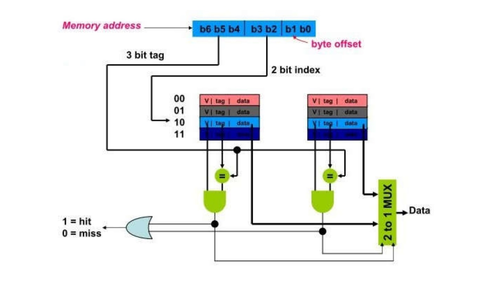

# Implementation of ARM968E-S Processor 

This repository contains the implementation of a student project for the Computer Architecture Lab course, supervised by Dr. Safari at the University of Tehran. The project consists of four main parts, each represented by a tag in the repository:

1. **Basics of ARM**: The initial implementation focusing on the foundational aspects of ARM architecture.
2. **Forwarding**: Enhancements to the basic ARM model by incorporating data forwarding techniques to resolve data hazards.
3. **SRAM Integration**: Addition of SRAM (Static Random Access Memory) to the existing ARM model.
4. **Cache Implementation**: Final part of the project which includes the implementation of a cache memory system.

## [Basics of ARM](https://github.com/erfanasgari21/Computer_Architecture_Lab_ARM/releases/tag/arm-base)
In this part, we implemented the foundational aspects of the ARM architecture.

### Features
- Basic ARM instruction set
- Fundamental pipeline stages

## Forwarding
In this part, we enhanced the basic ARM model by incorporating data forwarding techniques to resolve data hazards.

### Features
- Implementation of data forwarding to handle data hazards
- Improved pipeline efficiency

## SRAM Integration
In this part, we added SRAM (Static Random Access Memory) to the existing ARM model.

### Features
- SRAM integration with the ARM model
- Memory read/write operations

## Cache Implementation
In this final part, we implemented a cache memory system to further enhance the ARM model.

### Features
- Cache memory hierarchy
- Cache read/write operations
- Performance improvement with caching
